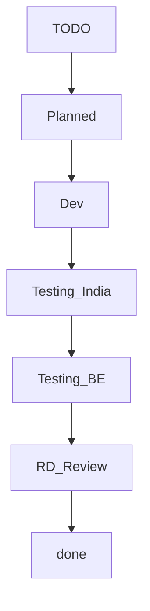
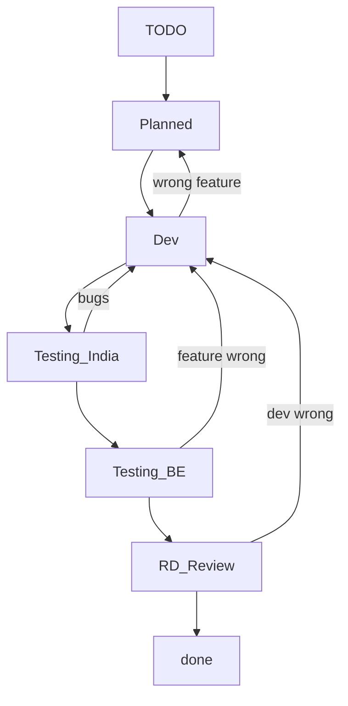
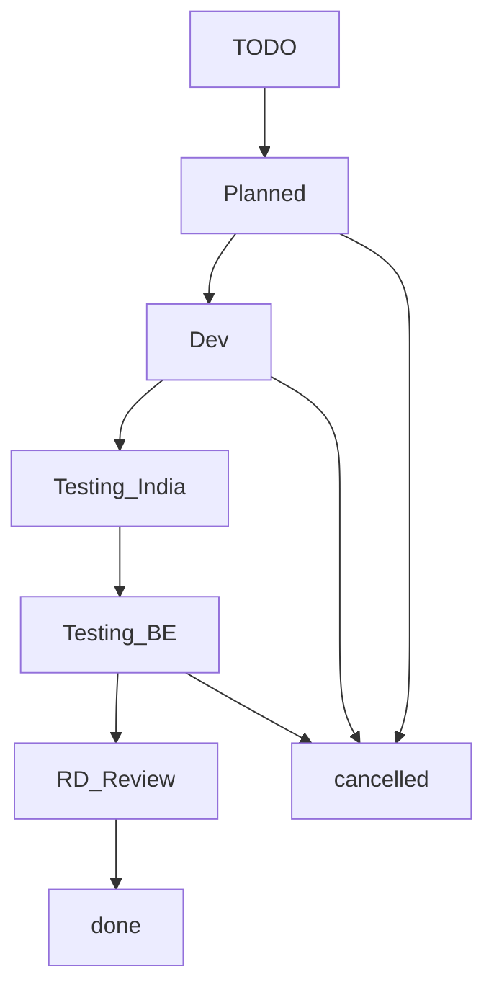

# Classic Software Development Lifecycle (SDL) workflow
* scrum         defines roles, has iterations, lots of ceremonies, focus on tasks, estimate user stories, sprint timelines 
* kanban        defines steps, focus on limit work in progress, no estimates, no timeline 
* waterfall     defines steps, defines roles, no iterations, focus on accountability, estimate everything, full timelines
* none          hope for the best and do what you can

# In Odoo
* mostly kanban

* people make mistakes

* business priorities change

# roles and responsibilities in R&D

* Fabien Pinkaers (FP) - CEO
  * does a lot of ordering of tasks, follows closely on tasks he cares about
* Antony Lessuise (AL) - CTO, our boss
  * involved in most technical discussions
  * involved in recruitment
  * does the first evaluation of everybody with Guru
* The development teams (21/06/2022)
* 
  * Each team has a functional or technical domain.
  * The teams are evolving (new/split/merge) all the time
* The PO's: the product owners
  * they define and order tasks
  * the work closely with FP and the gurus
  * devs go talk to them directly to ask questions and clarifications about tasks
  * they test all tasks
  * Each PO have one or more team
* The Gurus : the team leaders
  * every team has least one Guru
  * they are responsible first for the quality of the software
  * they are responsible for their team members (increase/decrease)

* The R+ssers: the people that can approve a PR
  * every guru has R+
  * The person that R+ takes responsibility for what he approves, along with the dev
  * people gain the right to R+ by gaining trust with Guru/AL

* The devs (you, me, most people around you when you are in GR2)
  * Take (or be assigned) the next most important task in the scope of the team he is
  * Manage their tasks in Odoo 
    * move to correct stage, with correct color depending on status
    * update the task description with the PO
  * Understand and clarify the task with the PO and Guru
  * Understand the business flow where the task fit, as well as the impacted business flows connex to the task
  * **Develop the code, the unit tests and the integration tests to complete the task**
  * Test manually that the task works
  * Fix their bugs/features/design/conventions/etc. until the task is R+
  * Manage their work in progress in branches on Git and Github
  * Create correct, meaningful commits for their work 
  * Create and followup on their pull request
  * Do not stay stuck: ask questions (to guru, neighbours, in chat on discord, on PR, etc.)
  * Take ownership of their task/domain/likings

